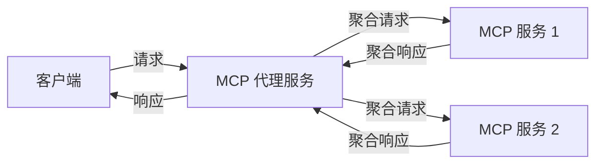
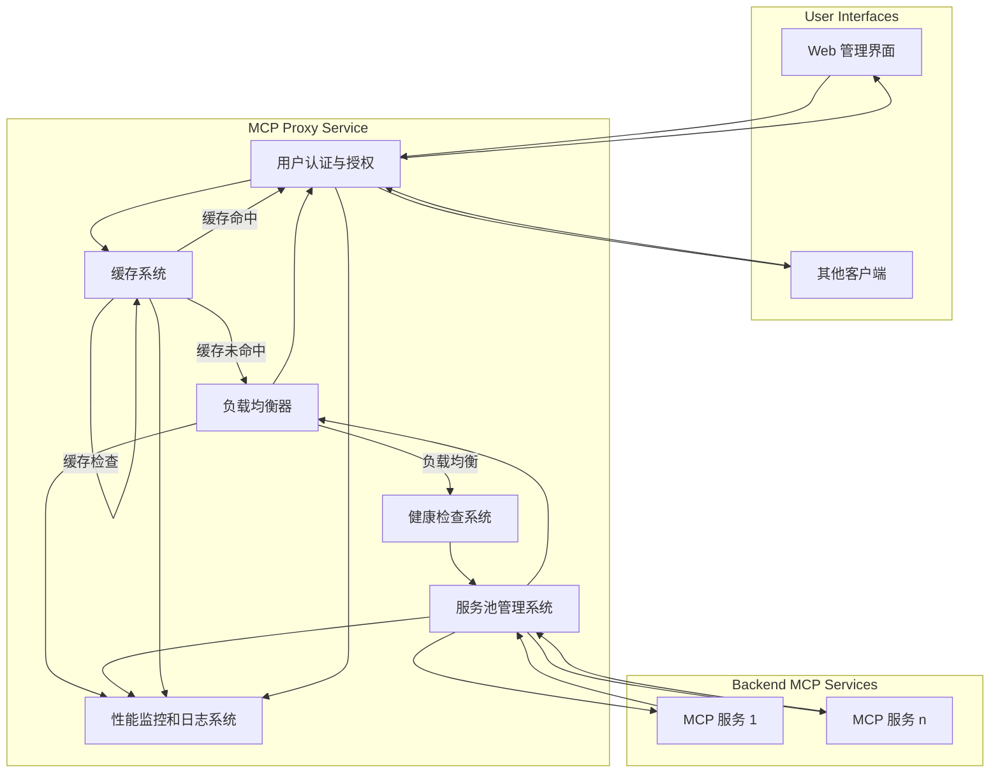

# MCP 代理服务功能需求文档

## 1. 项目概述

MCP Proxy Server 是一个代理服务器，能够聚合并服务多个 MCP 资源服务器，通过单一 HTTP 服务器提供统一的接口。该项目允许用户通过单一入口点访问多个不同的 MCP 客户端提供的工具和能力。通过引入用户角色管理和 Web 管理界面，旨在提供更便捷的管理方式和更精细化的权限控制。

## 2. 当前功能

### 2.1 核心功能

- **多 MCP 客户端代理**：连接到多个 MCP 资源服务器，聚合它们的工具和能力
- **SSE 支持**：提供 SSE（Server-Sent Events）服务器以支持实时更新
- **灵活配置**：支持多种客户端类型（`stdio` 和 `sse`）并有可定制的设置
- **路径清理和日志记录**：处理路径并记录请求和响应信息

### 2.2 服务器配置

- 基础 URL 配置
- 监听地址配置
- 服务器名称和版本信息配置

### 2.3 客户端类型

- **stdio 客户端**：通过命令行方式执行的客户端
- **SSE 客户端**：通过 SSE 连接的客户端

### 2.4 资源管理

- 聚合并管理多个客户端的工具（Tools）
- 聚合并管理多个客户端的提示（Prompts）
- 聚合并管理多个客户端的资源（Resources）
- 聚合并管理多个客户端的资源模板（Resource Templates）

## 3. 功能扩展需求

### 3.1 用户角色与权限管理

- **角色定义**：
    - `管理员 (Administrator)`：拥有所有管理权限，包括管理 MCP 服务、用户、配置等。
    - `普通用户 (Normal User)`：只能查看已配置的 MCP 服务列表，并为特定客户端生成配置文件。
- **管理员权限**：
    - 管理（增删改查）MCP 服务列表及其配置。
    - 管理（增删改查）普通用户账号。
    - 拥有普通用户的所有权限。
- **普通用户权限**：
    - 查看已配置的 MCP 服务列表。
    - 创建、管理自己的 MCP 配置组合。
    - 为指定的客户端（如 Cursor, Claude Desktop 等）生成包含所选 MCP 服务信息的配置文件（JSON 格式：`{"mcpServers":{...}}`）。
- **认证机制**：
    - 基于用户名和密码的登录认证。
    - (可选) 支持 API 密钥认证供程序化访问。

### 3.2 Web 管理界面

- **界面目标**：提供一个直观、易用的图形化界面来管理 MCP 代理服务。
- **未登录状态**：
    - **首页**：
        - 页面顶部：项目 Logo 和名称。
        - 右上角：登录入口。
        - 主区域：项目介绍、功能说明。
        - 统计数据展示：已安装/启用的 MCP 服务数量、累计调用次数等。
        - 超链接："查看调用趋势 (View Trending)"，链接到调用趋势页面。
    - **调用趋势页面 (Trending Page)**：
        - 展示 MCP 服务的调用频率、热门程度等趋势信息（参考：[https://openrouter.ai/rankings?view=trending](https://openrouter.ai/rankings?view=trending)）。
        - 可按时间范围（今日、本周、本月）筛选。
- **登录后状态**：
    - **通用顶部导航栏**：显示当前登录用户名、登出按钮。
    - **侧边栏导航**：
        - Home (MCP 服务列表)
        - 我的配置 (MCP Configurations)
        - (管理员可见) 用户管理
        - (管理员可见) 系统设置
    - **Home (MCP 服务列表) 页面**：
        - 标题：MCP Service List。
        - 右上角 (管理员可见)："+ 新增 MCP" 按钮。
        - 列表展示已安装的 MCP 服务：
            - **列**：名称、类型 (stdio/sse)、状态 (启用/禁用开关)、已调用次数、复制配置 (按钮 + 下拉菜单选择客户端如 Cursor/Claude/通用 JSON)、操作 (管理员可见：编辑/删除)。
            - **状态开关**：允许快速启用或禁用某个 MCP 服务。
            - **复制配置**：点击按钮或下拉菜单中的客户端选项，生成并允许用户复制单个 MCP 服务的接入配置信息。
    - **我的配置 (MCP Configurations) 页面**：
        - 标题：我的 MCP 配置。
        - 右上角："+ 新建配置" 按钮。
        - 列表展示用户创建的配置组合（方便不同场景使用）：
            - **列**：配置名称 (如 "for work", "for home")、包含 MCP 服务数量、复制配置文件 (按钮 + 下拉菜单选择客户端)、操作 (编辑/删除)。
            - **复制配置文件**：点击按钮或下拉菜单中的客户端选项，生成包含该配置组合中所有选定 MCP 服务信息的 JSON 配置文件 (`{"mcpServers":{...}}`)，供用户下载或复制。
    - **用户管理页面 (管理员可见)**：
        - 标题：用户管理。
        - 右上角："+ 新增用户" 按钮。
        - 列表展示所有普通用户：
            - **列**：用户名、创建时间、状态 (启用/禁用)、操作 (编辑/删除/重置密码)。
    - **系统设置页面 (管理员可见)**：
        - 提供服务器基础配置、日志级别、缓存策略等全局设置的界面。

### 3.3 高级监控和日志

- **性能监控**：实现对服务器和客户端性能的监控
- **详细日志**：增强日志记录功能，支持不同级别的日志
- **警报系统**：当服务异常时发送警报通知

### 3.4 缓存机制

- **响应缓存**：缓存频繁请求的响应以提高性能
- **配置缓存**：避免重复加载配置文件
- **智能缓存策略**：基于请求特性和使用频率的缓存策略

### 3.5 负载均衡

- **客户端负载均衡**：在多个相同功能的客户端之间分配负载
- **自动伸缩**：根据负载情况自动增加或减少客户端实例

### 3.6 客户端健康检查

- **定期检查**：定期检查客户端的健康状态
- **自动重连**：当客户端连接中断时自动重新连接
- **故障转移**：当客户端不可用时自动切换到备用客户端

### 3.7 API 版本控制

- **版本兼容性**：支持多个 API 版本以保证向后兼容性
- **版本协商**：客户端可以协商使用的 API 版本

## 4. 系统流程图

### 4.1 当前系统流程

### 4.2 扩展后系统流程

## 5. 实现优先级

1.  **用户角色与权限管理** - 最高优先级
2.  **Web 管理界面 (核心功能)** - 最高优先级 (包括登录、MCP 列表、配置列表及生成)
3.  **客户端健康检查** - 高优先级
4.  **Web 管理界面 (用户管理、系统设置、趋势页面)** - 中优先级
5.  **缓存机制** - 中优先级
6.  **高级监控和日志** - 中优先级
7.  **负载均衡** - 低优先级
8.  **API 版本控制** - 低优先级

## 6. 技术要求

- **后端**：继续使用 Go 语言开发，保持与现有 MCP Go 库的兼容性。
- **Web 前端**：选用现代 Web 框架（如 React, Vue, Svelte 或其他）或使用标准 HTML/CSS/JavaScript。
- **API**：提供清晰的 RESTful API 供 Web 前端调用。
- **数据库**：需要引入数据库（如 PostgreSQL, MySQL, SQLite）来存储用户信息、MCP 服务配置、用户配置组合等。
- **兼容性**：确保扩展功能不影响现有核心代理功能。
- **可维护性与可扩展性**：保持代码质量。
- **文档与测试**：提供必要的文档和单元/集成测试。

## 7. 时间线建议

- **阶段 1**（2-4周）：实现用户角色与权限管理 (包括数据库设计)、核心 Web 界面功能 (登录、MCP 列表展示、配置组合列表及生成)、客户端健康检查。
- **阶段 2**（2-3周）：实现 Web 界面剩余功能 (用户管理、系统设置、趋势页面)、缓存机制。
- **阶段 3**（2-3周）：实现高级监控和日志。
- **阶段 4**（待定）：实现负载均衡、API 版本控制。

## 8. 总结

通过实现上述扩展功能，特别是引入用户角色管理和 Web 管理界面，MCP 代理服务将转变为一个功能更全面、管理更便捷、权限控制更精细的平台。这将大大提升用户体验，特别是对于需要管理多个 MCP 服务和配置的管理员和普通用户。这些扩展将使系统更适合团队协作和在生产环境中使用。 